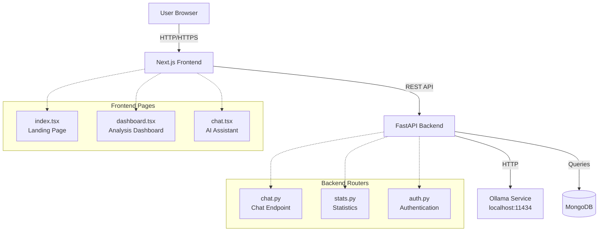
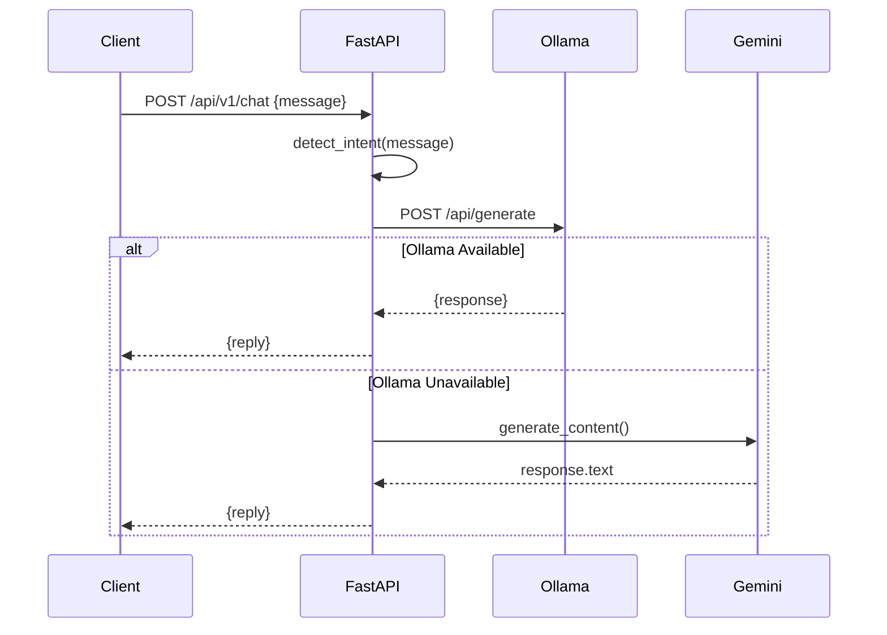

# Design Document: UI Improvements and Chatbot Restoration

## Overview

This design addresses UI improvements and chatbot restoration for the VeriGlow fake news detection application. The feature encompasses five main changes:

1. **Component Relocation**: Move the News Analyzer component from the home page (index.tsx) to the dashboard page (dashboard.tsx), leaving the home page as a clean landing page with only hero content
2. **Navigation Enhancement**: Add an "AI Assistant" link to the Navbar component positioned between "Signup" and "Dashboard"
3. **Backend Integration**: Re-enable the existing chat.py router in main.py to restore the /api/v1/chat endpoint
4. **Statistics Fix**: Modify the stats.py endpoint to query the MongoDB User_Collection directly instead of counting events
5. **Logo Addition**: Create and integrate an SVG logo component in the Navbar before the "DeepVerify" text

The existing chat.tsx page and chatAI API function are already implemented and functional. The backend chat.py router is complete with Ollama integration (http://localhost:11434, llama3.2 model) and Gemini fallback. This design focuses on enabling the disabled router and making the necessary UI adjustments.

## Architecture

### System Context



### Component Architecture

The application follows a three-tier architecture:

**Presentation Layer (Next.js/React/TypeScript)**
- Pages: index.tsx, dashboard.tsx, chat.tsx
- Components: Navbar, SearchBar, AuthMeter, SourceCards, HistoryItem
- API Client: lib/api.ts with axios interceptors

**Application Layer (FastAPI/Python)**
- Routers: auth.py, analyze_router.py, history.py, stats.py, chat.py
- Services: analysis_service, JWT management, password hashing
- Middleware: CORS, rate limiting, error handling

**Data Layer**
- MongoDB: users collection, history collection
- Ollama: Local LLM service for chat responses
- External APIs: NewsAPI for current events (optional)

## Components and Interfaces

### 1. News Analyzer Component Relocation

**Current State:**
- index.tsx contains the full News Analyzer UI (SearchBar, AuthMeter, SourceCards, statistics display, results rendering)
- dashboard.tsx only shows history list and minimal statistics

**Target State:**
- index.tsx displays only hero section (title, subtitle, navigation links)
- dashboard.tsx displays News Analyzer above the history list with full functionality

**Implementation Approach:**

Extract the following elements from index.tsx and move to dashboard.tsx:
- SearchBar component with input state and handleAnalyze function
- Statistics display (Users, Analyses, Real, Fake, Uncertain, Accuracy)
- Results rendering section (AuthMeter, confidence scores, HTML explanation, SourceCards)
- All related state variables: input, html, verdict, prob, sources, loading, language

**Component Interface:**

```typescript
// dashboard.tsx will contain:
interface AnalysisState {
  input: string;
  html: string;
  verdict: string;
  prob: Record<string, number>;
  sources: any[];
  loading: boolean;
  language: string | null;
}

// Reuse existing components:
<SearchBar value={input} onChange={setInput} onSubmit={handleAnalyze} loading={loading} />
<AuthMeter score={meterScore} label={label} />
<SourceCards sources={sources} />
```

### 2. Navbar Enhancement

**Current State:**
```typescript
// Navbar.tsx navigation order:
Home | Dashboard | Login | Signup | Logout
```

**Target State:**
```typescript
// Navbar.tsx navigation order:
Logo + DeepVerify | Home | Dashboard | AI Assistant | Login | Signup | Logout
```

**Logo Component Specification:**

```typescript
// components/Logo.tsx
interface LogoProps {
  className?: string;
  onClick?: () => void;
}

// SVG Design:
// - Magnifying glass icon combined with detective/investigator symbol
// - Maximum height: 32px
// - Clickable, navigates to home page
// - Positioned before "DeepVerify" text in nav-brand
```

**Navbar Modification:**

```typescript
// Navbar.tsx structure:
<div className="navbar">
  <Link href="/" className="nav-brand">
    <Logo className="nav-logo" />
    DeepVerify
  </Link>
  <div className="nav-links">
    <Link href="/" className="nav-link">Home</Link>
    <Link href="/dashboard" className="nav-link">Dashboard</Link>
    <Link href="/chat" className="nav-link">AI Assistant</Link>
    {/* Auth links remain unchanged */}
  </div>
</div>
```

### 3. Backend Chat Router Integration

**Current State:**
- chat.py router exists with full implementation
- main.py has the import and include_router lines commented out
- Ollama integration configured for http://localhost:11434 with llama3.2 model

**Target State:**
- chat.py router enabled in main.py
- /api/v1/chat endpoint accessible
- /api/v1/chat/health endpoint accessible

**Implementation:**

```python
# main.py modifications:
from chat import router as chat_router  # Uncomment

# In middleware configuration:
endpoint_configs={
    "/api/v1/analyze": RateLimitConfig(requests_per_minute=settings.rate_limit_analyze),
    "/api/v1/chat": RateLimitConfig(requests_per_minute=settings.rate_limit_chat),  # Already exists
    "/api/v1/auth/login": RateLimitConfig(requests_per_minute=settings.rate_limit_login),
}

# Router registration:
app.include_router(chat_router)  # Uncomment
```

**Chat Endpoint Interface:**

```python
# POST /api/v1/chat
class ChatIn(BaseModel):
    message: str

class ChatOut(BaseModel):
    reply: str

# GET /api/v1/chat/health
# Returns: {"status": "ok", "assistant": "VeriGlow AI (Ollama)", "models": ["llama3.2"]}
```

**Ollama Integration Flow:**



### 4. Statistics Endpoint Fix

**Current State:**
```python
# stats.py
@router.get("")
async def global_stats():
    total_users = await users.count_documents({})
    # ... other counts
```

**Issue Analysis:**
The current implementation already queries the users collection directly using `users.count_documents({})`. The requirement states to "query MongoDB User_Collection directly instead of counting events," but the code already does this. The issue may be in the signup flow or duplicate user creation.

**Verification Approach:**

Ensure the signup endpoint creates exactly one document per successful registration:

```python
# auth.py signup endpoint (already implemented correctly):
@router.post("/signup", response_model=TokenOut)
async def signup(payload: Signup, settings: Settings = Depends(get_app_settings)):
    existing = await users.find_one({"email": payload.email})
    if existing:
        raise HTTPException(status_code=400, detail="Email already registered")
    
    # ... password validation and hashing
    
    res = await users.insert_one(doc)  # Single insert
    uid = str(res.inserted_id)
    # ... return tokens
```

**Implementation:**

No changes needed to stats.py or auth.py. The implementation already:
1. Checks for existing email before signup
2. Inserts exactly one document per successful signup
3. Counts documents in the users collection for statistics

The stats endpoint correctly queries the User_Collection (users) directly.

### 5. Logo Component

**SVG Design Specification:**

```typescript
// components/Logo.tsx
export default function Logo({ className = "", onClick }: LogoProps) {
  return (
    <svg
      width="32"
      height="32"
      viewBox="0 0 32 32"
      fill="none"
      xmlns="http://www.w3.org/2000/svg"
      className={className}
      onClick={onClick}
      style={{ cursor: onClick ? 'pointer' : 'default' }}
    >
      {/* Magnifying glass circle */}
      <circle cx="12" cy="12" r="8" stroke="currentColor" strokeWidth="2" fill="none" />
      
      {/* Magnifying glass handle */}
      <line x1="18" y1="18" x2="24" y2="24" stroke="currentColor" strokeWidth="2" strokeLinecap="round" />
      
      {/* Detective hat (simplified) */}
      <path d="M8 10 L12 6 L16 10" stroke="currentColor" strokeWidth="1.5" fill="none" />
      <line x1="6" y1="10" x2="18" y2="10" stroke="currentColor" strokeWidth="1.5" />
      
      {/* Checkmark inside magnifying glass */}
      <path d="M9 12 L11 14 L15 10" stroke="currentColor" strokeWidth="1.5" strokeLinecap="round" strokeLinejoin="round" fill="none" />
    </svg>
  );
}
```

**Integration:**

```typescript
// Navbar.tsx
import Logo from "./Logo";

<Link href="/" className="nav-brand">
  <Logo className="nav-logo" />
  <span>DeepVerify</span>
</Link>
```

**Styling:**

```css
/* Add to global styles or Navbar component */
.nav-brand {
  display: flex;
  align-items: center;
  gap: 8px;
}

.nav-logo {
  width: 32px;
  height: 32px;
  flex-shrink: 0;
}
```

## Data Models

### User Document (MongoDB users collection)

```typescript
interface UserDocument {
  _id: ObjectId;
  name: string;
  email: string;
  password_hash: string;
  language_pref: string;
  failed_login_attempts: number;
  locked_until: string | null;
  last_failed_attempt: string | null;
  last_login: string | null;
  created_at: string;
}
```

### History Document (MongoDB history collection)

```typescript
interface HistoryDocument {
  _id: ObjectId;
  user_id: string;
  query: string;
  verdict: string;
  confidence: number;
  scores: Record<string, number>;
  sources: Array<{
    title: string;
    url: string;
    snippet: string;
  }>;
  language: string;
  reviewed: boolean;
  correct: boolean | null;
  created_at: string;
}
```

### Chat Request/Response

```typescript
// Frontend
interface ChatMessage {
  from: "user" | "bot";
  text: string;
  id: string;
}

// API
interface ChatRequest {
  message: string;
}

interface ChatResponse {
  reply: string;
}
```

### Statistics Response

```typescript
interface StatsResponse {
  total_users: number;
  total_analyses: number;
  total_real: number;
  total_fake: number;
  total_uncertain: number;
  total_reviews: number;
  correct_votes: number;
}
```


## Correctness Properties

A property is a characteristic or behavior that should hold true across all valid executions of a system—essentially, a formal statement about what the system should do. Properties serve as the bridge between human-readable specifications and machine-verifiable correctness guarantees.

### Property 1: Signup Creates Exactly One User Document

For any valid signup request with a unique email, successfully completing the signup process should result in exactly one new document being inserted into the User_Collection, and the total_users statistic should increase by exactly 1.

**Validates: Requirements 5.3, 5.6**

This property ensures the integrity of user registration and statistics. It verifies that:
- No duplicate user documents are created during signup
- The statistics accurately reflect the number of registered users
- Each successful signup has a one-to-one correspondence with a user document

**Testing Approach:**
- Generate random valid signup payloads with unique emails
- Record the initial user count
- Execute signup
- Verify exactly one document exists for that email
- Verify total_users increased by exactly 1


## Error Handling

### Frontend Error Handling

**Component Relocation Errors:**
- If stats API fails, display placeholder values ("—") instead of crashing
- If analysis API fails, show user-friendly error message in results area
- Maintain loading states to prevent duplicate submissions

**Chat Interface Errors:**
- Network errors: Display "Connection failed" message with retry option
- Ollama unavailable: Backend automatically falls back to Gemini, user sees seamless experience
- Rate limiting: Display "Too many requests" message with countdown timer
- Empty message submission: Prevent submission, no error message needed

**Navigation Errors:**
- 404 handling: Next.js default 404 page
- Protected routes: Redirect to login if accessing dashboard without authentication

### Backend Error Handling

**Chat Router Errors:**
```python
# Already implemented in chat.py:
try:
    # Attempt Ollama connection
    response = requests.post("http://localhost:11434/api/generate", ...)
except requests.exceptions.ConnectionError:
    # Fallback to Gemini
    return await generate_response_gemini(...)
except Exception as e:
    # Log error and return user-friendly message
    logger.error("Chat generation failed: %s", e, exc_info=True)
    return ChatOut(reply="Sorry, something went wrong. Please try again.")
```

**Statistics Errors:**
```python
# MongoDB connection errors
try:
    total_users = await users.count_documents({})
except Exception as e:
    logger.error("Stats query failed: %s", e)
    return {"total_users": 0, ...}  # Return zeros instead of 500 error
```

**Signup Errors:**
```python
# Already implemented in auth.py:
# - Duplicate email: 400 "Email already registered"
# - Weak password: 400 with validation errors
# - Database errors: 500 with generic message (don't expose internals)
```

### Error Recovery Strategies

**Ollama Service Down:**
1. Chat router attempts Ollama connection
2. On ConnectionError, automatically falls back to Gemini API
3. Health endpoint reports fallback status
4. User experience is uninterrupted

**MongoDB Connection Issues:**
1. Motor client configured with 5-second timeouts
2. Failed queries return empty results instead of crashing
3. Frontend displays placeholder values
4. Background retry logic in connection pool

**Rate Limiting:**
1. Middleware returns 429 status with headers
2. Frontend displays countdown timer
3. User can retry after cooldown period

## Testing Strategy

### Overview

This feature requires a dual testing approach combining unit tests for specific examples and edge cases with property-based tests for universal properties. The majority of requirements are example-based (testing specific UI elements, routes, and behaviors), with one key property test for signup integrity.

### Unit Testing

**Frontend Component Tests (React Testing Library + Jest)**

Test the component relocation:
```typescript
// index.test.tsx
describe("Home Page", () => {
  it("displays only hero section without News Analyzer", () => {
    render(<Home />);
    expect(screen.getByText("DeepVerify")).toBeInTheDocument();
    expect(screen.queryByPlaceholderText(/paste article/i)).not.toBeInTheDocument();
  });
  
  it("does not display statistics", () => {
    render(<Home />);
    expect(screen.queryByText("Users")).not.toBeInTheDocument();
  });
});

// dashboard.test.tsx
describe("Dashboard Page", () => {
  it("displays News Analyzer above history list", () => {
    render(<Dashboard />);
    const analyzer = screen.getByPlaceholderText(/paste article/i);
    const history = screen.getByText(/history/i);
    expect(analyzer.compareDocumentPosition(history)).toBe(Node.DOCUMENT_POSITION_FOLLOWING);
  });
  
  it("displays all required statistics", () => {
    render(<Dashboard />);
    expect(screen.getByText("Users")).toBeInTheDocument();
    expect(screen.getByText("Analyses")).toBeInTheDocument();
    expect(screen.getByText("Real")).toBeInTheDocument();
    expect(screen.getByText("Fake")).toBeInTheDocument();
    expect(screen.getByText("Uncertain")).toBeInTheDocument();
    expect(screen.getByText("Accuracy")).toBeInTheDocument();
  });
  
  it("submits analysis and displays results", async () => {
    const mockAnalyze = jest.fn().mockResolvedValue({
      data: { verdict: "Real", scores: { "Real News": 0.85 }, html: "<p>Analysis</p>", sources: [] }
    });
    render(<Dashboard />);
    
    const input = screen.getByPlaceholderText(/paste article/i);
    const button = screen.getByText(/analyze/i);
    
    fireEvent.change(input, { target: { value: "Test article" } });
    fireEvent.click(button);
    
    await waitFor(() => {
      expect(screen.getByText(/85.0%/)).toBeInTheDocument();
    });
  });
});
```

Test the Navbar enhancements:
```typescript
// Navbar.test.tsx
describe("Navbar Component", () => {
  it("displays AI Assistant link between Signup and Dashboard", () => {
    render(<Navbar authed={false} />);
    const links = screen.getAllByRole("link");
    const aiIndex = links.findIndex(l => l.textContent === "AI Assistant");
    const signupIndex = links.findIndex(l => l.textContent === "Signup");
    const dashboardIndex = links.findIndex(l => l.textContent === "Dashboard");
    
    expect(aiIndex).toBeGreaterThan(signupIndex);
    expect(aiIndex).toBeLessThan(dashboardIndex);
  });
  
  it("displays AI Assistant link for both auth states", () => {
    const { rerender } = render(<Navbar authed={false} />);
    expect(screen.getByText("AI Assistant")).toBeInTheDocument();
    
    rerender(<Navbar authed={true} />);
    expect(screen.getByText("AI Assistant")).toBeInTheDocument();
  });
  
  it("navigates to /chat when AI Assistant is clicked", () => {
    const mockPush = jest.fn();
    jest.mock("next/router", () => ({ useRouter: () => ({ push: mockPush }) }));
    
    render(<Navbar authed={false} />);
    fireEvent.click(screen.getByText("AI Assistant"));
    expect(mockPush).toHaveBeenCalledWith("/chat");
  });
});

// Logo.test.tsx
describe("Logo Component", () => {
  it("renders SVG with correct dimensions", () => {
    render(<Logo />);
    const svg = screen.getByRole("img", { hidden: true });
    expect(svg).toHaveAttribute("width", "32");
    expect(svg).toHaveAttribute("height", "32");
  });
  
  it("contains magnifying glass and detective elements", () => {
    const { container } = render(<Logo />);
    expect(container.querySelector("circle")).toBeInTheDocument();
    expect(container.querySelector("line")).toBeInTheDocument();
    expect(container.querySelector("path")).toBeInTheDocument();
  });
  
  it("navigates to home when clicked", () => {
    const mockClick = jest.fn();
    render(<Logo onClick={mockClick} />);
    fireEvent.click(screen.getByRole("img", { hidden: true }));
    expect(mockClick).toHaveBeenCalled();
  });
});
```

Test the chat interface:
```typescript
// chat.test.tsx
describe("Chat Page", () => {
  it("displays message input and conversation history", () => {
    render(<ChatPage />);
    expect(screen.getByPlaceholderText(/ask me anything/i)).toBeInTheDocument();
    expect(screen.getByText(/Welcome to VeriGlow Assistant/i)).toBeInTheDocument();
  });
  
  it("sends message to API and displays response", async () => {
    const mockChatAI = jest.fn().mockResolvedValue({ reply: "Test response" });
    jest.mock("../lib/api", () => ({ chatAI: mockChatAI }));
    
    render(<ChatPage />);
    const input = screen.getByPlaceholderText(/ask me anything/i);
    const button = screen.getByText(/send/i);
    
    fireEvent.change(input, { target: { value: "Test message" } });
    fireEvent.click(button);
    
    await waitFor(() => {
      expect(screen.getByText("Test response")).toBeInTheDocument();
    });
  });
  
  it("displays loading indicator while waiting", async () => {
    render(<ChatPage />);
    const input = screen.getByPlaceholderText(/ask me anything/i);
    const button = screen.getByText(/send/i);
    
    fireEvent.change(input, { target: { value: "Test" } });
    fireEvent.click(button);
    
    expect(screen.getByText(/thinking/i)).toBeInTheDocument();
  });
  
  it("displays error message on API failure", async () => {
    const mockChatAI = jest.fn().mockRejectedValue(new Error("Network error"));
    jest.mock("../lib/api", () => ({ chatAI: mockChatAI }));
    
    render(<ChatPage />);
    const input = screen.getByPlaceholderText(/ask me anything/i);
    const button = screen.getByText(/send/i);
    
    fireEvent.change(input, { target: { value: "Test" } });
    fireEvent.click(button);
    
    await waitFor(() => {
      expect(screen.getByText(/something went wrong/i)).toBeInTheDocument();
    });
  });
});
```

**Backend API Tests (pytest + httpx)**

Test the chat router integration:
```python
# test_chat_router.py
def test_chat_router_enabled():
    """Verify chat router is registered in main app"""
    assert any("/api/v1/chat" in str(route.path) for route in app.routes)

def test_chat_endpoint_exists(client):
    """Verify /api/v1/chat endpoint responds"""
    response = client.post("/api/v1/chat", json={"message": "Hello"})
    assert response.status_code in [200, 429]  # 200 or rate limited

def test_chat_health_endpoint(client):
    """Verify /api/v1/chat/health endpoint exists"""
    response = client.get("/api/v1/chat/health")
    assert response.status_code == 200
    assert "status" in response.json()

@patch("requests.post")
def test_chat_forwards_to_ollama(mock_post, client):
    """Verify chat router forwards to Ollama service"""
    mock_post.return_value.status_code = 200
    mock_post.return_value.json.return_value = {"response": "Test reply"}
    
    response = client.post("/api/v1/chat", json={"message": "Test"})
    
    mock_post.assert_called_once()
    call_args = mock_post.call_args
    assert "localhost:11434" in call_args[0][0]
    assert call_args[1]["json"]["model"] == "llama3.2"

@patch("requests.post")
def test_chat_fallback_on_ollama_unavailable(mock_post, client):
    """Verify fallback to Gemini when Ollama is down"""
    mock_post.side_effect = requests.exceptions.ConnectionError()
    
    response = client.post("/api/v1/chat", json={"message": "Test"})
    
    # Should still return 200 with fallback response
    assert response.status_code == 200
    assert "reply" in response.json()

def test_duplicate_email_signup_rejected(client):
    """Verify duplicate email signup is rejected"""
    payload = {"name": "Test", "email": "test@example.com", "password": "SecurePass123!"}
    
    # First signup succeeds
    response1 = client.post("/api/v1/auth/signup", json=payload)
    assert response1.status_code == 200
    
    # Second signup with same email fails
    response2 = client.post("/api/v1/auth/signup", json=payload)
    assert response2.status_code == 400
    assert "already registered" in response2.json()["detail"].lower()
```

Test the statistics endpoint:
```python
# test_stats.py
async def test_stats_counts_user_documents():
    """Verify stats endpoint counts User_Collection documents"""
    # Insert test users
    await users.insert_many([
        {"email": "user1@test.com", "name": "User 1", "password_hash": "hash1"},
        {"email": "user2@test.com", "name": "User 2", "password_hash": "hash2"},
    ])
    
    response = client.get("/api/v1/stats")
    assert response.status_code == 200
    assert response.json()["total_users"] >= 2
    
    # Cleanup
    await users.delete_many({"email": {"$in": ["user1@test.com", "user2@test.com"]}})
```

### Property-Based Testing

**Configuration:**
- Library: Hypothesis (Python) for backend tests
- Minimum iterations: 100 per property test
- Tag format: Feature: ui-improvements-and-chatbot-restoration, Property {number}: {property_text}

**Property Test Implementation:**

```python
# test_signup_property.py
from hypothesis import given, strategies as st
import pytest

@given(
    name=st.text(min_size=1, max_size=100),
    email=st.emails(),
    password=st.text(min_size=12, max_size=128).filter(
        lambda p: any(c.isupper() for c in p) and 
                  any(c.islower() for c in p) and 
                  any(c.isdigit() for c in p)
    )
)
@pytest.mark.property_test
async def test_signup_creates_exactly_one_document(name, email, password):
    """
    Feature: ui-improvements-and-chatbot-restoration, Property 1: 
    For any valid signup request with a unique email, successfully completing 
    the signup process should result in exactly one new document being inserted 
    into the User_Collection, and the total_users statistic should increase by exactly 1.
    """
    # Ensure email is unique for this test
    await users.delete_many({"email": email})
    
    # Record initial count
    initial_count = await users.count_documents({})
    
    # Perform signup
    payload = {"name": name, "email": email, "password": password}
    response = client.post("/api/v1/auth/signup", json=payload)
    
    # If signup succeeded (not all random passwords will meet requirements)
    if response.status_code == 200:
        # Verify exactly one document for this email
        email_count = await users.count_documents({"email": email})
        assert email_count == 1, f"Expected 1 document for {email}, found {email_count}"
        
        # Verify total count increased by exactly 1
        final_count = await users.count_documents({})
        assert final_count == initial_count + 1, \
            f"Expected count to increase by 1 (from {initial_count} to {initial_count + 1}), got {final_count}"
        
        # Cleanup
        await users.delete_one({"email": email})
```

### Integration Testing

**End-to-End Scenarios:**

1. **Complete Analysis Workflow on Dashboard:**
   - User logs in
   - Navigates to dashboard
   - Submits article text for analysis
   - Receives verdict, scores, and sources
   - Analysis appears in history list

2. **Chat Interaction Flow:**
   - User clicks "AI Assistant" in navbar
   - Navigates to /chat page
   - Sends message
   - Receives AI response
   - Continues conversation

3. **Statistics Accuracy:**
   - Record initial stats
   - Create new user via signup
   - Verify stats incremented correctly
   - Perform analysis
   - Verify analysis stats incremented

### Test Coverage Goals

- Frontend components: >80% coverage
- Backend routers: >90% coverage
- Critical paths (auth, analysis, chat): 100% coverage
- Property tests: 100 iterations minimum per property

### Testing Tools

**Frontend:**
- Jest: Test runner
- React Testing Library: Component testing
- MSW (Mock Service Worker): API mocking

**Backend:**
- pytest: Test runner
- httpx: Async HTTP client for API testing
- pytest-asyncio: Async test support
- Hypothesis: Property-based testing
- mongomock: MongoDB mocking for unit tests

**Integration:**
- Playwright or Cypress: E2E testing
- Docker Compose: Test environment setup

